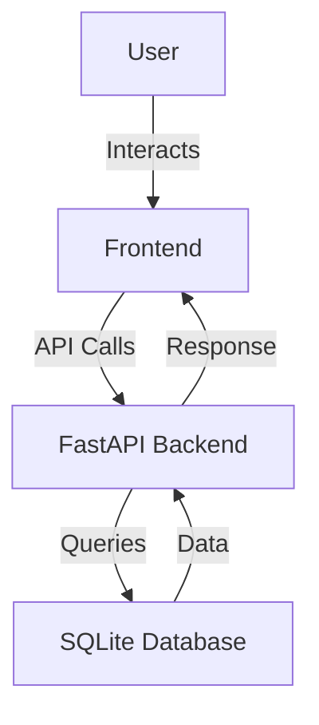

# Web3 Decentralized Marketplace Explorer

## Overview
The Web3 Decentralized Marketplace Explorer is a comprehensive application designed to facilitate seamless interaction with decentralized marketplaces. This project offers a user-friendly interface for exploring, viewing, and managing marketplace listings and user profiles. It is particularly beneficial for blockchain enthusiasts, developers, and users interested in decentralized commerce. By leveraging the power of FastAPI and SQLite, the application provides a robust backend to support dynamic content rendering and data management.

## Features
- **Dynamic Listing Display**: Fetch and display marketplace listings dynamically using JavaScript, allowing users to view real-time data.
- **User Profile Management**: Create and manage user profiles with wallet addresses and profile information.
- **Transaction History**: View transaction history for users, providing insights into past activities.
- **Responsive Design**: Utilizes Bootstrap for a clean and responsive user interface that works across devices.
- **FastAPI Backend**: A powerful and asynchronous backend framework to handle API requests efficiently.
- **SQLite Database**: Lightweight database for storing listings, users, and transactions, ensuring quick data retrieval.
- **HTML Templating**: Uses Jinja2 for rendering dynamic HTML pages based on user interactions.

## Tech Stack
| Component        | Technology  |
|------------------|-------------|
| Backend          | FastAPI     |
| Frontend         | HTML, CSS (Bootstrap), JavaScript |
| Database         | SQLite      |
| Templating       | Jinja2      |
| Web Server       | Uvicorn     |

## Architecture
The application follows a typical MVC architecture:
- **Backend**: FastAPI serves as the backend API, handling requests and interacting with the SQLite database.
- **Frontend**: HTML templates rendered with Jinja2, styled with Bootstrap, and enhanced with JavaScript for dynamic content.
- **Data Flow**: User interactions trigger API calls, which fetch data from the database and return it to the frontend for display.



## Getting Started

### Prerequisites
- Python 3.11+
- pip (Python package installer)

### Installation
1. Clone the repository:
   ```bash
   git clone https://github.com/yourusername/web3-decentralized-marketplace-explorer-auto.git
   cd web3-decentralized-marketplace-explorer-auto
   ```
2. Install the required Python packages:
   ```bash
   pip install -r requirements.txt
   ```
3. Ensure the database is set up:
   - The application will automatically create the database and tables on the first run if they do not exist.

### Running the Application
1. Start the FastAPI application using Uvicorn:
   ```bash
   uvicorn app:app --reload
   ```
2. Visit the application in your browser at `http://127.0.0.1:8000`

## API Endpoints
| Method | Path                  | Description                                |
|--------|-----------------------|--------------------------------------------|
| GET    | /api/listings         | Retrieve all marketplace listings          |
| GET    | /api/listings/{id}    | Retrieve a specific listing by ID          |
| POST   | /api/users            | Create a new user profile                  |
| GET    | /api/users/{wallet_address} | Retrieve user profile by wallet address |
| GET    | /api/transactions     | Retrieve transactions for a user wallet    |

## Project Structure
```
web3-decentralized-marketplace-explorer-auto/
├── app.py                  # Main application file containing API logic
├── Dockerfile              # Docker configuration for containerization
├── requirements.txt        # Python dependencies
├── start.sh                # Shell script to start the application
├── static/                 # Static files (CSS, JavaScript)
│   ├── css/
│   │   └── bootstrap.min.css # Bootstrap CSS for styling
│   └── js/
│       ├── listing_detail.js # JS for listing detail page
│       ├── listings.js       # JS for listings page
│       └── profile.js        # JS for profile page
└── templates/             # HTML templates rendered by Jinja2
    ├── about.html          # About page template
    ├── index.html          # Home page template
    ├── listing_detail.html # Listing detail page template
    ├── listings.html       # Listings page template
    └── profile.html        # User profile page template
```

## Screenshots
*Screenshots of the application interface will be added here.*

## Docker Deployment
To deploy the application using Docker:
1. Build the Docker image:
   ```bash
   docker build -t web3-marketplace-explorer .
   ```
2. Run the Docker container:
   ```bash
   docker run -d -p 8000:8000 web3-marketplace-explorer
   ```

## Contributing
Contributions are welcome! Please fork the repository and submit a pull request with your changes. Ensure that your code follows the project’s coding standards and includes appropriate tests.

## License
This project is licensed under the MIT License.

---
Built with Python and FastAPI.
